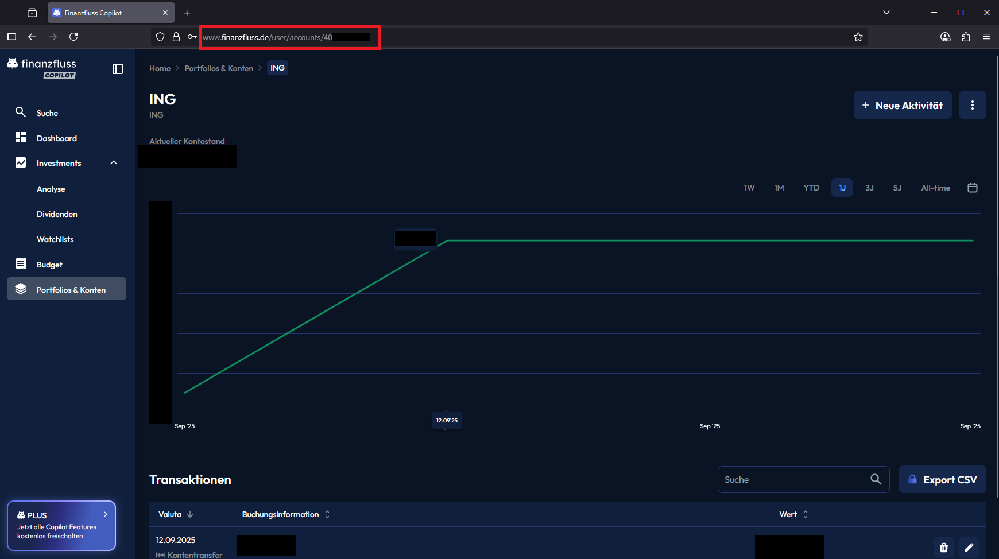

# Finanzfluss Exporter 🚀


---

## ℹ️ Wofür ist dieses Skript geeignet?

Dieses Skript verarbeitet Transaktionen aus der offiziellen [Finanzfluss Copilot Website](https://www.finanzfluss.de/copilot).  
Es automatisiert das Einloggen, Auslesen der Transaktionen und speichert diese sicher in einer lokalen **JSON-Datei**.  
Das Skript ist ausschließlich für die Nutzung mit **eigenen Kontodaten** bestimmt.

### 🔑 Wichtig
- Keine Zugangsdaten oder API-Keys ins Repository einchecken.  
- Das Skript umgeht keine Sicherheitsmechanismen und greift nur regulär über die Website auf die Daten zu.  
- Nutzer sind selbst verantwortlich für die Einhaltung der Nutzungsbedingungen ihres Copilot-Accounts und den sicheren Umgang mit exportierten Daten.  


## ✨ Features

- 🔐 **Sicheres Login** mit System-Keyring Verschlüsselung
- 📊 **Automatisches Scraping** von Transaktionen mehrerer Konten
- 💾 **JSON-Export** für einfache Weiterverarbeitung
- 👀 **Übersichtliche Konsolenausgabe** aller Transaktionen
- ⚡ **Einfach erweiterbar** für weitere Konten und Funktionen
- 🛡️ **Maximale Sicherheit** - keine Passwörter im Code

---

## 📦 Voraussetzungen

```bash
# Erforderliche Pakete installieren
pip install selenium keyring
```

**Browser:** Firefox (wird automatisch gesteuert)

---

## ⚙️ Einrichtung

### 1. Abhängigkeiten installieren
```bash
pip install selenium keyring
```

### 2. Passwort sicher speichern
Erstelle eine temporäre Datei `save_password.py`:

```python
import keyring

# DEINE DATEN HIER EINTRAGEN:
EMAIL = "deine_email@beispiel.de"
PASSWORD = "dein_passwort_hier"

# Passwort sicher im System-Keyring speichern
keyring.set_password("finanzfluss", EMAIL, PASSWORD)
print("✅ Passwort wurde sicher gespeichert!")
```

Führe die Datei **einmalig** aus:
```bash
python save_password.py
```

**🔒 WICHTIG:** Lösche oder bearbeite die Datei anschließend, um das Passwort zu entfernen!

### 3. Konten konfigurieren
Öffne `finanzfluss_copilot.py` und passe die Konten-URLs an:

```python
ACCOUNTS = {
    "ING": "https://www.deine-finanz-app.de/user/accounts/406....",
    "Trade Republic": "https://www.deine-finanz-app.de/user/accounts/406...."
}

EMAIL = "deine_email@beispiel.de"  # Hier deine E-Mail eintragen
```



---

## 🚀 Nutzung

```bash
python finanzfluss_copilot.py
```

**Ablauf:**
1. Firefox öffnet sich automatisch
2. Login mit sicher aus dem Keyring geladenem Passwort
3. Transaktionen werden von allen konfigurierten Konten gescraped
4. Ergebnisse werden in der Konsole angezeigt
5. Daten werden in `transaktionen.json` gespeichert
6. Browser schließt sich nach Bestätigung

---

## 🔒 Sicherheitsfeatures

- **Keine Passwörter im Code** oder Dateien
- **Verschlüsselte Speicherung** im System-Keyring
- **Automatische Verschlüsselung** durch Betriebssystem
- **Sichere Abfrage** bei jeder Ausführung

---

## 🗝️ Passwort-Verwaltung

**Passwort aktualisieren:**
```bash
# save_password.py erneut ausführen und neues Passwort eintragen
python save_password.py
```

**Passwort-Status prüfen:**
```python
import keyring
print("Passwort vorhanden:", bool(keyring.get_password("finanzfluss", "deine_email@beispiel.de")))
```

---

## 📊 JSON-Ausgabe Beispiel

Die generierte `transaktionen.json`:

```json
[
  {
    "datum": "2025-09-14",
    "buchung": "Gehaltseingang",
    "betrag": "2.500,00 €",
    "zusatzinfo": "",
    "konto": "ING"
  },
  {
    "datum": "2025-09-10",
    "buchung": "Amazon Einkauf",
    "betrag": "-49,99 €",
    "zusatzinfo": "Online-Shopping",
    "konto": "Trade Republic"
  }
]
```

---

## 🛠️ Problembehebung

**Falls das Passwort nicht gefunden wird:**
1. Sicherstellen, dass `save_password.py` ausgeführt wurde
2. E-Mail Adresse in Script und Save-Script identisch
3. System-Keyring Service ist aktiviert

**Bei Login-Problemen:**
- Webseiten-Struktur könnte sich geändert haben
- Captcha oder 2FA könnte den Login blockieren

---

## 🔒 Status
- [x] Passwortverschlüsselung fertig (Linux-Anpassung noch ausstehend)

## 💡 Geplante Erweiterungen
- [ ] Konto-Sync über Finanzfluss (verbundene Bankkonten)
- [ ] CSV-/Excel-Export
- [ ] Depotdaten-Scraping (Aktien, Fonds, Stückzahl, Kauf- und Tageskurs)
---

## 📄 Lizenz  

MIT License – siehe [LICENSE](LICENSE) Datei für Details.  
